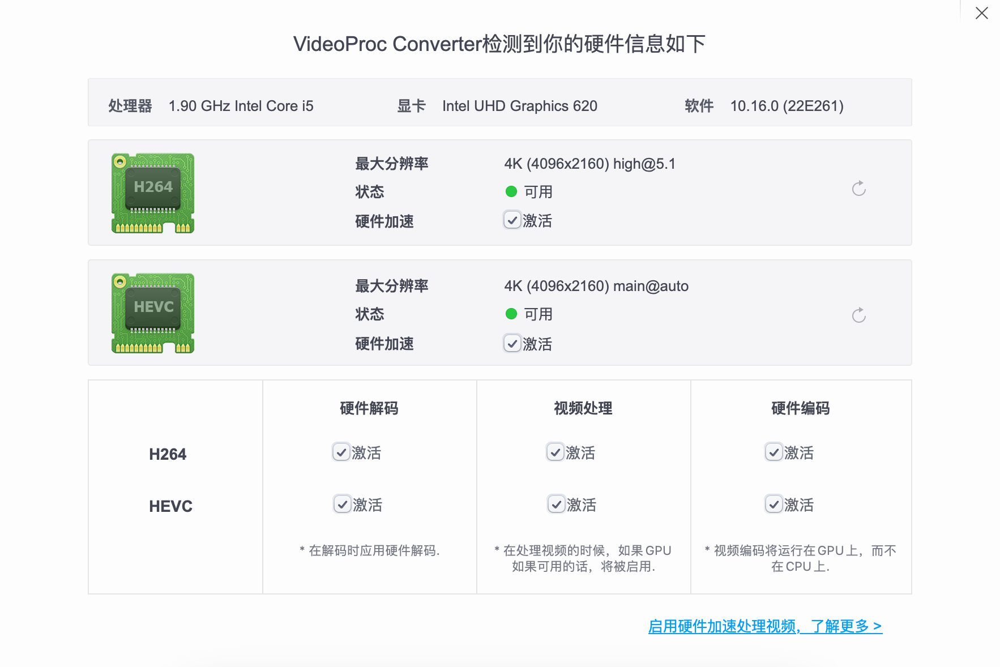

# OpenCore-ThinkPad-L480
 Hackintosh for ThinkPad L480

# Specs

| Component      | Brand                                     |
|----------------|-------------------------------------------|
| **CPU**        | `Intel Core i5-8350U vPro @ 1.6 GHz`           |
| **GPU**       | `Intel UHD Graphics 620`                  |
| **Storage**    | `LENSE30256GMSP34MEAT3TA PCIe 256 GB`  |
| **Audio** | `Realtek ALC3287 (ALC257)`                |
| **WLAN**  | `Intel Dual Band Wireless-AC 8265`   |
| **Bluetooth**  | `Intel Dual Band Wireless-AC 8265`   |
| **Ethernet**  | `Intel Ethernet Connection I219-LM`   |
| **OS**         | `macOS Big Sur 11.4`          |
   
# Updating macOS to a newer version? 
We now have Ventura, check for new branch!
   
# HiDPI
 Use `https://github.com/xzhih/one-key-hidpi` to enable HiDPI, then set the resolution to `1424 x 802`

# Working
* Keyboard
* TrackPoint / TrackPad
* Ethernet
* Wi-Fi
* Bluetooth
* AirDrop
* Graphics card (Hardware decode)
* Speaker and headphone jack
* Camera
* Microphone
* Smart Card reader
* USB ports
* HDMI port
* Sleep / resume

# Not working
* You tell me :D
   
# Some pictures

